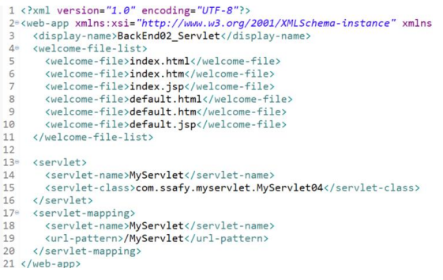
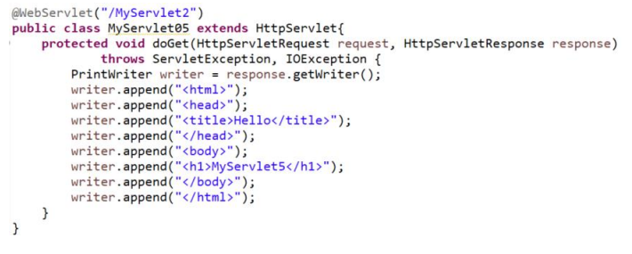
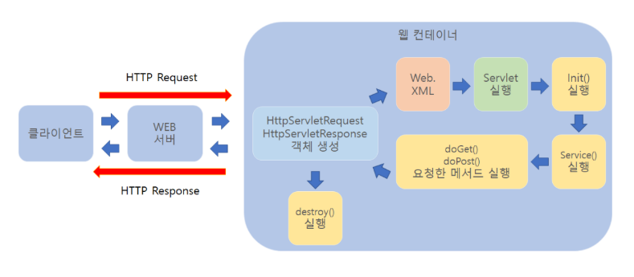

# BackEnd

## 웹 프로그래밍

### 웹 아키텍처


### 웹과 웹 프로그래밍
- URL (Uniform Resource Locator) - 웹 상의 자원을 참조하기 위한 웹 주소
- 웹 페이지 (Web page) - 웹 브라우저를 통해서 보여지는 화면
- 웹 서버 (Web Server) - 클라이언트 요청에 맞는 응답(웹 페이지)을 제공
- 웹 애플리케이션 (Web Application) - 웹 서버를 기반으로 실행되는 응용 소프트웨어
- 웹 애플리케이션 서버 (Web Application Server, WAS) - 요청이 오면 알맞은 프로그램을 실행하여 응답을 만들고 제공하는 서버

## Servlet

### 서블릿이란?


`서블릿(Servlet)이란 동적 웹 페이지를 만들 때 사용되는 자바 기반의 웹 애플리케이션 프로그래밍 기술이다. 서블릿은 웹 요청과 응답의 흐름을 간단한 메서드 호출만으로 체계적으로 다룰 수 있게 해준다.`

- 서블릿은 서버에서 실행되다가 웹 브라우저에서 요청을 하면 해당 기능을 수행한 후 웹 브라우저에 결과를 전송한다.

- 쉽게 예를들면 로그인 시도를 할 때, 서버가 클라이언트에서 입력되는 아이디와 비밀번호를 확인하고 결과를 응답하는데 이러한 역할을 수행하는 것이 서블릿이다.

### 서블릿의 주요 특징
- 클라이언트의 Request에 대해 동적으로 작동하는 웹 애플리케이션 컴포넌트
- 기존의 정적 웹 프로그램의 문제점을 보완하여 동적인 여러 가지 기능을 제공
- JAVA의 스레드를 이용하여 동작
- MVC패턴에서 컨트롤러로 이용됨
- 컨테이너에서 실행
- 보안 기능을 적용하기 쉬움

### 서블릿 등록방법
1. web.xml



2. Annotation



### 서블릿의 동작 과정



- 클라이언트가 웹 서버에 요청하면 웹 서버는 그 요청을 톰캣과 같은 WAS(Web Application Server)에 위임한다. 그러면 WAS는 각 요청에 해당하는 서블릿을 실행한다. 그리고 서블릿은 요청에 대한 기능을 수행한 후 결과를 반환하여 클라이언트에 전송한다.

1. 클라이언트 요청
2. HttpServletRequest, HttpServletResponse 객체 생성
3. Web.xml이 어느 서블릿에 대해 요청한 것인지 탐색
4. 해당하는 서블릿에서 service() 메소드 호출
5. doGet() 또는 doPost() 호출
6. 동적 페이지 생성 후 ServletResponse 객체에 응답 전송
7. HttpServletRequest, HttpServletResponse 객체 소멸

### 서블릿 형식

```java
public class FirstServlet extends HttpServlet {
	@Override
    public void init() {
    ...
	}
    
    @Override
    public void doGet(HttpServletRequest req, HttpServletResponse resp) {
    ...
    }
    
    @Override
    public void destroy() {
    ...
    }
}
```

### 서블릿의 생명주기
`서블릿도 자바 클래스이므로 실행하면 초기화부터 서비스 수행 후 소멸하기까지의 과정을 거친다. 이 과정을 서블릿의 생명주기라하며 각 단계마다 호출되어 기능을 수행하는 콜백 메서드를 서블릿 생명주기 메서드라한다.`

1. 클라이언트의 요청이 들어오면 컨테이너는 해당 서블릿이 메모리에 있는지 확인하고, 없을 경우 init() 메서드를 호출하여 메모리에 적재한다. init()은 처음 한번만 실행되기 때문에, 서블릿의 스레드에서 공통적으로 사용해야 하는 것이 있다면 오버라이딩 하여 구현하면 된다. 실행 중 서블릿이 변경될 경우, 기존 서블릿을 destroy()하고 init()을 통해 새로운 내용을 다시 메모리에 적재한다.
2. init()이 호출된 후 클라이언트의 요청에 따라서 service() 메소드를 통해 요청에 대한 응답이 doGet()과 doPost로 분기된다. 이 때 서블릿 컨테이너가 클라이언트의 요청이 오면 가장 먼저 처리하는 과정으로 생성된 HttpServletRequest, HttpServletResponse에 의해 request와 response 객체가 제공된다.
3. 컨테이너가 서블릿에 종료 요청을 하면 destroy() 메소드가 호출되는데 마찬가지로 한 번만 실행되며, 종료시에 처리해야 하는 작업들은 destroy() 메소드를 오버라이딩하여 구현하면 된다.

### 서블릿 생명주기 메서드
- 초기화: init()
    - 서블릿 요청 시 맨 처음 한 번만 호출된다.
    - 서블릿 생성 시 초기화 작업을 주로 수행한다.
- 작업 수행: doGet(), doPost()
    - 서블릿 요청 시 매번 호출된다.
    - 실제로 클라이언트가 요청하는 작업을 수행한다.
- 종료: destroy()
    - 서블릿이 기능을 수행하고 메모리에서 소멸될 때 호출된다.
    - 서블릿의 마무리 작업을 주로 수행한다.

### 서블릿 컨테이너
`서블릿 컨테이너란, 구현되어 있는 servlet 클래스의 규칙에 맞게 서블릿을 담고 관리해주는 컨테이너다. 클라이언트에서 요청을 하면 컨테이너는 HttpServletRequest, HttpServletResponse 두 객체를 생성하여 get, post여부에 따라 동적인 페이지를 생성하여 응답을 보낸다.`

- 웹서버와의 통신 지원
    - 서블릿 컨테이너는 서블릿과 웹서버가 손쉽게 통신할 수 있게 해준다. 일반적으로 소켓을 만들고 listen, accept 등을 해야하지만 서블릿 컨테이너는 이러한 기능을 API로 제공하여 복잡한 과정을 생략할 수 있게 해준다. 그래서 개발자가 서블릿에 구현해야 할 비지니스 로직에 대해서만 초점을 두게끔 도와준다.
- 서블릿 생명주기 관리
    - 서블릿 컨테이너는 서블릿 클래스를 로딩하여 인스턴스화하고, 초기화 메소드를 호출하고, 요청이 들어오면 적절한 서블릿 메소드를 호출한다. 또한 수명이 다 된 서블릿을 적절하게 가비지 콜렉터를 호출하여 필요없는 자원 낭비를 막아준다.
- 멀티쓰레드 지원 및 관리
    - 서블릿 컨테이너는 Request가 올 때마다 새로운 자바 쓰레드를 하나 생성하는데, HTTP 서비스 메소드를 실행하고 나면, 쓰레드는 자동으로 죽게 된다. 원래는 쓰레드를 관리해야 하지만 서버가 다중 쓰레드를 생성 및 운영해주니 쓰레드의 안정성에 대해서 걱정하지 않아도 된다.
- 선언적인 보안 관리
    - 서블릿 컨테이너를 사용하면 개발자는 보안에 관련된 내용을 서블릿 또는 자바 클래스에 구현해 놓지 않아도 된다. 일반적으로 보안관리는 XML 배포 서술자에다가 기록하므로, 보안에 대해 수정할 일이 생겨도 자바 소스 코드를 수정하여 다시 컴파일 하지 않아도 보안관리가 가능하다.