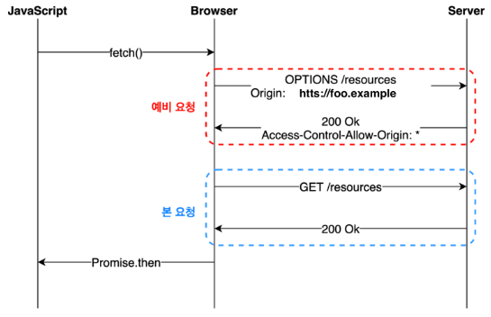

# BackEnd

## Swagger

### Swagger를 이용한 REST API 문서화
- 프로젝트 개발 시 일반적으로 FrontEnd 개발자와 BackEnd 개발자가 분리된다.
- FrontEnd 개발자의 경우 화면에 집중하고 BackEnd 개발자가 만든 문서 API를 보며 데이터 처리를 하게 된다.
- 이때 개발 상황의 변화에 따른 API의 추가 또는 변경할 때 마다 문서에 적용하는 불편함 발생
- 이 문제를 해결하기 위해 Swagger를 사용

### Swagger 기능
- 기존 문서로 사용하던 문제를 해결하기 위해 Swagger를 사용
- 간단한 설정으로 프로젝트의 API 목록을 웹에서 확인 및 테스트 할 수 있게 해주는 Library
- Swagger를 사용하면 Controller에 정의되어 있는 모든 URL을 바로 확인할 수 있다.
- API 목록 뿐 아니라 API의 명세 및 설명도 볼 수 있으며, 또한 API를 직접 테스트해 볼 수도 있다.

### Swagger 적용
1. pom.xml에 **springfox-swagger2**, **springfox-swagger-ui** dependency를 추가한다.

```xml
    <!-- https://mvnrepository.com/artifact/io.springfox/springfox-swagger2 -->
    <dependency>
        <groupId>io.springfox</groupId>
        <artifactId>springfox-swagger2</artifactId>
        <version>2.9.2</version>
    </dependency>
    <!-- https://mvnrepository.com/artifact/io.springfox/springfox-swagger-ui -->
    <dependency>
        <groupId>io.springfox</groupId>
        <artifactId>springfox-swagger-ui</artifactId>
        <version>2.9.2</version>
    </dependency>
```

2. SwaggerConfiguration 파일을 작성
- Swagger 설정 확인
    - http://localhost:8000/{your-app-root}/v2/api-docs
    - e.g. http://localhost:8000/web/v2/api-docs?group=V1
- Swagger-UI 확인
    - http://localhost:8080/{your-app-root}/swagger-ui.html
    - e.g. http://localhost:8000/web/swagger-ui.html

```java
@Configuration
@EnableSwagger2
public class SwaggerConfiguration {
 
    private String version = "V1";
    private String title = "Han GuestBook API " + version;
    
    @Bean
    public Docket api() {
        List<ResponseMessage> responseMessages = new ArrayList<ResponseMessage>();
        responseMessages.add(new ResponseMessageBuilder().code(200).message("OK").build());
        responseMessages.add(new ResponseMessageBuilder().code(500).message("서버 문제 발생").responseModel(new ModelRef("Error")).build());
        responseMessages.add(new ResponseMessageBuilder().code(404).message("페이지를 찾을 수 없습니다").build());
        
        return new Docket(DocumentationType.SWAGGER_2).apiInfo(apiInfo()).groupName(version).select()
                    .apis(RequestHandlerSelectors.basePackage("com.han.web.controller"))
                    .paths(postPaths()).build()
                    .useDefaultResponseMessages(false) // responseMessages 설정 적용
                    .globalResponseMessage(RequestMethod.GET,responseMessages);
    }
    
    private Predicate<String> postPaths() {
//      return PathSelectors.any(); // 모든 경로를 api 문서로 만들경우
//      return or(regex("/admin/.*"), regex("/user/.*"));  // 일부 경로를 api 문서로 만들 경우
        return regex("/admin/.*");
    }
 
    private ApiInfo apiInfo() {
        return new ApiInfoBuilder().title(title)
                .description("<h3>HAN API Reference for Developers</h3>Swagger를 이용한 GuestBook API<br>") 
                .contact(new Contact("HAN", "https://han.com", "98cline@gmail.com"))
                .license("HAN License")
                .licenseUrl("https://www.han.com/etc/webPrivacy.jsp")
                .version("1.0").build();
    }
}
```

- line 10~13) responseMessage들을 추가할 수 있다.
- line 15~19) SWAGGER Docket에 api 정보를 담은 apiInfo()의 결과와 변수로 선언한 version 정보, 다룰 Controller들이 있는 package 정보 api 문서로 만들 경로가 담긴 PostPaths()의 결과 responseMessages 설정을 적용한 후 return 해준다. 

### Swagger 관련 Annotation

| Annotation | Description |
| -- | -- |
| @Api | Controller가 REST 방식을 처리하기 위한 것임을 명시 |
| @Apilgnore | Class, method에 선언이 가능하며 클라이언트에 노출하고 싶지않은 경우 사용 |
| @ApiOperation | 제공되는 API에 대한 간단한 설명 |
| @ApiModel | URL 경로에 있는 값을 파라미터로 추출 |
| @ApiModelProperty | 결과로 응답되는 데이터 필드에 대한 설명 |
| @ApiImplicitParam | API 요청시 설정하는 파라미터에 대한 설명 |
| @ApiImplicitParams | API 요청시 설정하는 파라미터가 여러개일 경우 ApiImplicitParam과 함께 사용 |

## CORS
- CORS는 Cross Origin Resource Sharing의 약자로 **도메인** 또는 **포트**가 다른 서버의 자원을 요청하는 매커니즘을 말한다.
- 오픈 API를 사용하기 위해서나, 여러가지 더 좋은 기능들의 개발을 위해 서로 다른 도메인간에도 통신이 필요하다.
- 요청을 할 때는 cross-origin HTTP에 의해 요청된다.
- 하지만 동일 출처 정책(same-origin policy) 때문에 CORS 같은 상황이 발생하면 외부서버에 요청한 데이터를 브라우저에서 보안목적으로 차단한다.


### 동일 출처 정책(same-origin policy)
- 불러온 문서나 스크립트가 다른 출처에서 가져온 리소스와 상호작용하는 것을 제한하는 중요한 보안 방식이다.
- 잠재적 악성 문서를 격리하여, 공격 경로를 줄이는데 도움이 된다.

### CORS 동작 방식
1. 간단한 요청(Simple Requests)
2. 사전 요청(Preflight Requests)
3. 인증을 이용하는 요청(Credential Requests)

### 간단한 요청(Simple Requests)
- 기존 데이터를 손상시키지 않을 요청들에 의해서만 가능하다.
- GET, HEAD, POST 중 한가지 요청
- Custom Header가 존재하지 않는 경우
- POST일 경우, Content-Type이 application/x-www-form-urlencoded, mutipart/form-data. text/plain 중 하나
- 요즘은 대부분 API 요청을 application/json을 통해서 보내기 때문에 Simple Requests는 잘 사용되지 않는다.

### 사전 요청(Preflight Requests)
- 본 요청을 보내기전에 사전 요청을 보내서 서버가 이에 대해서 응답이 가능한지를 확인하는 방법



- 위 그림을 보면, `https://foo.example`에서 예비요청을 보내고, 이에 대해서 Access-Control-Allow-Origin와 서버에서 현재 어떤것들을 허용하고 금지하는지에 대한 정보를 응답헤더에 담아 브라우저에게 다시 보내준다.

### 인증을 이용하는 요청(Credential Requests)
- 보안을 강화시킨 요청으로, 인증 정보들을 추가로 쿠키등으로 요청에 담아서 보내는 방식이다.
- 서버는 이 사용자가 보낸 요청에 포함된 인증정보들로 한번 더 검증하여 인증이 된 사용자에게만 응답을 준다.
- Access-Control-Allow-Origin을 *로 설정할 수 없으며, 반드시 명시적인 URL들로 설정해주어야 한다.
- 반드시 응답 헤더에는 Access-Control-Allow-Credentials: true가 포함되어야만 Credential Requests의 자격요건을 갖게 된다.


### Spring에서 CORS 적용하기
1. **Annotation** 사용
- Controller 또는 메서드에 @CrossOrigin 어노테이션을 달아준다.

```java
@GetMapping("/v1/volunteers")
@CrossOrigin(origins = "*", allowHeaders = "*")
public List<VolunteerResponseDto> findAll() {
        return volunteerService.findAll();
   }
```

- v1/volunteers로 요청이 들어오면, CrossOrigin에 설정해준 Origin에서 들어온 요청만 본응답을 받게 된다. 위 코드에서는 *로 와일드카드를 사용해주었으므로, 모든 출처에서의 요청에 대한 응답을 해준다.

- 메서드뿐만 아니라 컨트롤러에도 적용할 수 있다.

```java
@RequiredArgsConstructor
@RestController
@CrossOrigin(origins = "*")
public class VolunteerController {
    private final VolunteerService volunteerService;

	@GetMapping("/v1/volunteers")
	public List<VolunteerResponseDto> findAll() {
	    return volunteerService.findAll();
	}
}
```

2. **Configuration** 사용
- Spring의 Configuration을 통해서 프로젝트 전체에 적용하는 방식이다.
- config 패키지에 WebConfig 클래스를 만들어준 뒤, WebMvcConfigurer를 implements 해준다.

```java
@Configuration
public class WebConfig implements WebMvcConfigurer {    

}
```

- 여기서 CORS 설정을 위해서 필요한 메서드인 addCorsMappings 메서드를 오버라이딩한다.

```java
@Configuration
public class WebConfig implements WebMvcConfigurer {
    @Override
    public void addCorsMappings(final CorsRegistry registry) {
    }
}
```

- 이렇게 하면 CoreRegistry 클래스에 있는 addMapping을 이용해서 CORS를 적용해줄 URL 패턴을 정의 해줄 수 있다.

```java
@Configuration
public class WebConfig implements WebMvcConfigurer {
    @Override
    public void addCorsMappings(final CorsRegistry registry) {
        registry.addMapping("/**")
        // /**로 와일드카드를 사용하여 모든 URL 패턴에 대해 허용해준 상태
    }
}
```