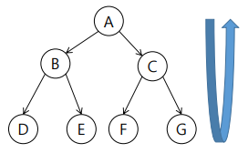
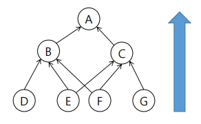

# APS 기본

## 동적 계획법
- 그리디 알고리즘과 같이 **최적화 문제**를 해결하는 알고리즘
- 최적화 문제: 최적(최대값이나 최소값 같은) 값을 구하는 문제
	- 해당 문제에 여러 해가 있을 수 있다.
	- 특정한 최적해를 구하는 것이 아니라 어떤 최적해를 구하는 것이다.
- 동적 계획 알고리즘은 먼저 작은 부분 문제들의 해들을 구하고, 이들을 이용하여 보다 큰 크기의 부분 문제들을 해결하여, 최종적으로 원래 주어진 문제를 해결하는 알고리즘 설계 기법이다.
- 동적 계획법을 적용하려는 문제는 **중복 부분문제 구조**와 **최적 부분문제 구조** 요건을 가지고 있어야 한다.

### 중복 부분문제 구조 (Overlapping subproblems)
- DP는 큰 문제를 이루는 작은 문제들을 먼저 해결하고, 작은 문제들의 최적 해(Optimal Solution)을 이용하여 순환적으로 큰 문제를 해결한다.
- DP는 문제의 순환적인 성질 때문에 이전에 계산되어졌던 작은 문제의 해가 다른 어딘가에서 필요하게 되는데 이를 위해 DP에서는 이미 해결된 작은 문제들의 해들을 어떤 저장 공간(Table)에 저장하게 된다.
- 저장된 해들이 다시 필요할 때 마다 해를 얻기 위해 다시 문제를 재계산하지 않고, table의 참조를 통해서 중복된 계산을 피하게 된다.

### 최적 부분문제 구조 (Optimal substructrue)
- 최적화의 원칙이란 어떤 문제에 대한 해가 최적일 때, 그 해를 구성하는 작은 문제들의 해 역시 최적이어야 한다.
- 동적 계획법의 방법 자체가 큰 문제의 최적 해를 작은 문제의 최적해들을 이용하여 구하기 때문에 만약 큰 문제의 최적해가 작은 문제들의 최적해들로 구성되지 않는다면 해당 문제는 동적 계획법을 적용할 수 없다.

### 분할 정복 vs 동적 계획법

### 분할 정복
- 연관 없는 부분 문제로 분할 한다.
- 부분 문제를 재귀적으로 해결한다.
- 부분 문제의 해를 결합(Combine)한다.
- 하향식 방법
- e.g. 병합정렬, 퀵정렬

### 동적 계획법
- 부분 문제들이 연관이 없으면 적용할 수 없다. (즉, 부분 문제들은 더 작은 부분 문제들을 공유한다)
- 모든 부분 문제를 한 번만 계산하고, 결과를 저장하고 재사용한다. (분할 정복은 같은 부분 문제가 나타날 경우 다시 계산한다)
- 상향식 방법

### 동적 계획법 적용 방법 3단계
1. 최적해 구조의 특성을 파악
	- 문제를 부분 문제로 나눈다.
2. 최적해의 값을 재귀적으로 정의
	- 부분 문제의 최적해 값에 기반하여 문제의 최적해 값을 정의한다.
3. 상향식 방법으로 최적해의 값을 계산
	- 가장 작은 부분 문제부터 해를 구한 뒤 테이블에 저장한다.
	- 테이블에 저장되어 있는 부분 문제의 해를 이용하여 점차적으로 상위 부분 문제의 최적해를 구한다.(상향식 방법)